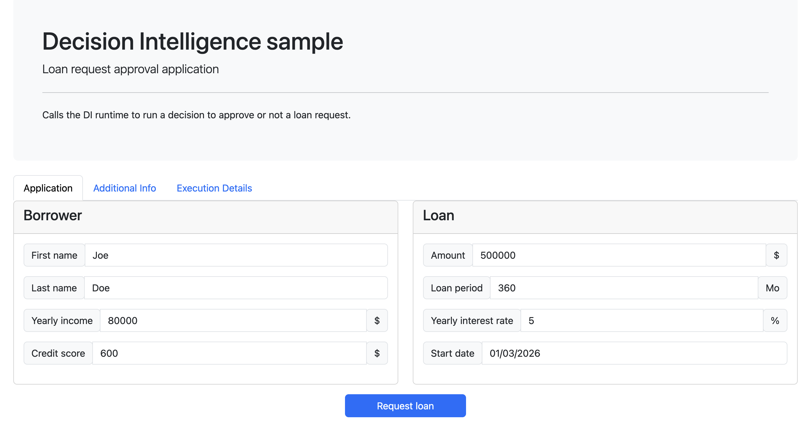
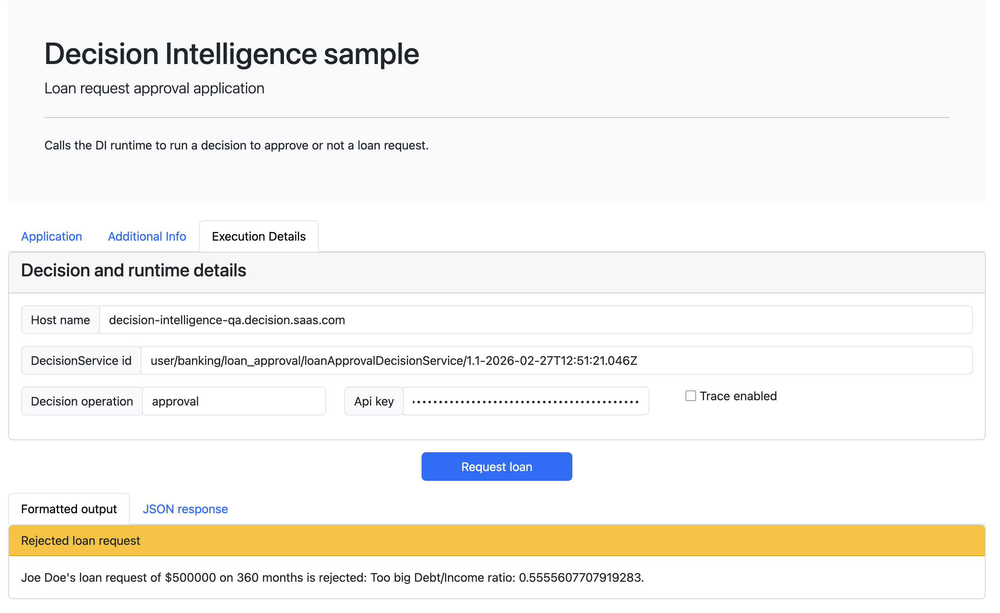

# Sample: Loan Validation application

## Description
This sample shows a web application calling a decision service built into Decision Intelligence. It provides code for a web-based client application 
which calls a decision service archive to process loan requests using the decision runtime.

## Learning objectives
- Deploy a decision service to the decision runtime.
- Configure a web application to call a decision service using the decision runtime REST API.
- Run the web application with representative data.
- Explore the execution trace.

## Audience

This sample is for anyone who wants to call a decision service deployed to the decision runtime.

## Time required

15 minutes

## Prerequisites

- Decision Intelligence: You should have access to Decision Intelligence. Decision Intelligence includes Decision Designer, a comprehensive authoring environment where you can develop, test, and deploy decision services.
- API key: To call the decision services you deployed from Decision Intelligence, you must use an API key.
For more information about API keys, see [Creating API keys](https://www.ibm.com/docs/en/saas-console?topic=usca-granting-access-through-service-ids-api-keys-from-saas-console#creating_APIkeys)
- Websphere Application Server Liberty: A Java application server that you can download from [Download WAS Liberty](https://developer.ibm.com/wasdev/downloads/). This sample was tested with **WebSphere Liberty Web Profile 8 26.0.0.1**.
- Apache Maven: A software project management tool that you can download from [Welcome to Apache Maven](https://maven.apache.org).

It is recommended that you go through the tutorial [Creating and deploying a decision service](https://www.ibm.com/docs/en/decision-intelligence?topic=tutorials-creating-deploying-decision-service) before using this sample.

# Setting up the sample
The web application defined in this sample calls a decision service that returns a decision about approving a loan or not. It is based on the Loan Approval decision service defined in the Banking sample project. You start by exploring the decision service in Decision Designer. Then, you deploy the web application and execute it with the appropriate parameters.

## Deploying the decision service
You use Decision Designer to explore and deploy a decision service.

1. Sign in to Decision Intelligence using your instance credentials.
2. Create a decision automation.
3. Click `New decision +`.
4. Click `Industry samples` and select `Banking`. Then, click Import.
Open the `Loan Approval` decision service.
5. Explore the imported decision service:
    - Go to the `Data` tab and open the `Loan Validation Data` data model to review the defined types.
    - Navigate back to the decision service name in the breadcrumbs and open the `Approval Decision Model`. This model determines whether a loan can be approved. 
    - Go to the `Run` tab  to run the predefined test data sets.
6. When you are finished exploring the decision service, click the `Share changes` icon in the top toolbar. Keep only `Loan approval` selected and click on `Share`. 
7. Go to the `Deploy`tab. Create a new version `1.0.0`and deploy it.
8. When the deployment has completed, copy the decision ID. You will need this parameter in the next step.

## Building and deploying the client application
In this section, you download the repository for the sample application, set properties to match your decision service deployment, and build the application WAR file.

1. Download a compressed file of the `decision-intelligence-samples` Git repository.
2. Set the values noted as `TO BE SET` in the file `samples/LoanApplicationSample/src/main/webapp/resources/config.js`:
   - **SERVER_NAME**: The name of the host server on which you run Decision Intelligence, you just copy the first part of the URL used in the previous step, for example `ibm.decision-intelligence.decision.saas.com`. Only the name is required, not the complete URL.
   - **DI_API_KEY**: The credentials you need to call the decision runtime REST API. For more about API keys, see [Creating API keys](https://www.ibm.com/docs/en/saas-console?topic=usca-granting-access-through-service-ids-api-keys-from-saas-console#creating_APIkeys)
   - **DECISION_SERVICE_ID**: The decision ID of the decision service you deployed in the previous step.
3. Edit the `samples/LoanApplicationSample/pom.xml` file to set the `<liberty-path>` property to the path of your Liberty application server.
4. Run the following command in the `samples/LoanApplicationSample` directory:
```
mvn clean install
```
 The command:
 
 - Creates the client application WAR file.
 - Creates and starts a Liberty server.
 - Deploys the client application to the server.

You can use the application when you see the message ``` BUILD SUCCESS```.

**Note:** If you want to modify and build the application again, follow the instructions in the section [Modifying this sample](./README.md#modifying-this-sample) at the end of this readme.

# Sample details
1. In a browser, open the URL ```http://localhost:9080/loanApplicationSample-1.0-SNAPSHOT/```:



2. Switch to the `Execution Details` tab: the values for the server name (called host name in the application) and the decision service ID are the ones you entered in the `config.js` file.
3. Click **Request loan**, and look at the results.



4. Select **Trace Enabled**, and click **Request loan** again to get more details on the execution trace. You can choose between viewing the formatted output or the complete JSON response. You can play with the input values to change the results. For example, in the `Application` tab, if you change the amount to 2000000, you get the message ``` The loan cannot exceed 1000000.```

# Modifying this sample

When you want to modify the application or stop using it, follow these instructions:

- To stop the Liberty server, run the following command in the ```<path to Liberty>/bin``` directory: ```./server stop testDI ```
- To remove the Liberty server, delete the ```<path to Liberty>/usr/servers/testDI``` directory.
- To rebuild the sample and create the Liberty server again, run the following command in the `samples/LoanApplicationSample` directory: ```mvn clean install```         

When you modify the decision automation or stop using it, follow these instructions:         
- To modify the decision automation:
    1. Open Decision Intelligence.
    2. Make and test your changes.
    3. Share your changes, create and deploy a new version.
    4. Use the decision service id newly deployed in the `Loan application`.
    
- To delete the decision automation:
    1. Open Decision Intelligence.
    2. Open the decision automation created for this sample.
    3. In the `Deploy` tab, undeploy all the versions you deploy to test.
    2. Click on `Decision Automations` in the breadcrumbs.
    3. Open the menu of the decision automation card you created for this sample, select `Delete`.

